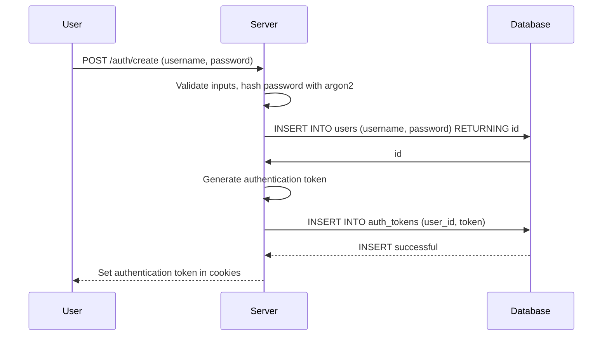
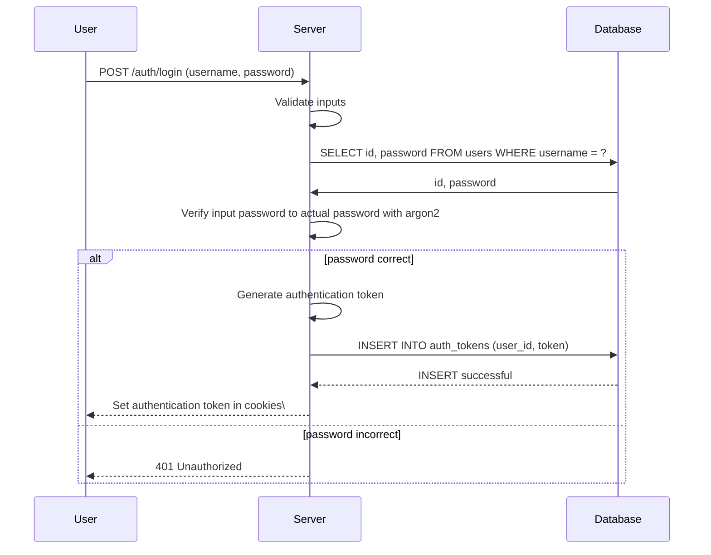

# SavePoints

SavePoints is a social platform for gamers to share reviews and ratings on their favorite games while discovering new games through community recommendations.

## Table of Contents

- [Setup](#setup)
- [API Endpoints](#api-endpoints)
- [Database Schema](#database-schema)
- [User Authentication Flow](#user-authentication-flow)

## Setup

### Prerequisites

Before you can start developing with SavePoints, you'll need to make sure you have the following installed on your system:

- [Node](https://nodejs.org/en/download/)
- [Git](https://git-scm.com/downloads)
- [PostgreSQL](https://www.postgresql.org/download)

### Installation

To get starting with development, follow these steps:

**1. Clone the repository using Git:**

```bash
git clone https://github.com/Save-Points/SavePoints.git
```

You may need to generate a personal access token through GitHub to clone via HTTPS.

**2. Navigate to the root of the project and install the required dependencies:**

```bash
npm install
```

**3. Configure .env file:**

Copy the `.env.sample` file into a new file called `.env` and configure the variables as needed

**4. Setup the PostgreSQL database:**

```bash
npm run setup
```

**5. Running the server:**

After you are ready to run the server to test your code, run the command:

```bash
npm run start
```

## API Endpoints

### `POST /auth/create`

**Description:** Create new user account. On success, logs the user in to the newly created account and sets auth token in their cookies.

**Request Body:**

```json
{
    "username": "user",
    "password": "password"
}
```

**Responses:**

**201 Created**

```
No body is returned, generated auth token is set in user's cookies.
```

**400 Bad Request** - Input validation failed.

```json
{
    "error": "Invalid input.",
    "fields": {
        "email": "Invalid email format.",
        "username": "Username must be 4-20 characters. Allowed characters are letters, numbers, dots, underscores, and hyphens.",
        "password": "Password must be at least 8 characters.",
        "birthdate": "You must be at least 13 years old to create an account."
    }
}
```

**500 Internal Server Error** - Server failure (hashing, insert to database, or auth token creation)

```json
{
    "error": "Internal server error."
}
```

### `POST /auth/login`

**Description:** Log in to an existing user account. On success, sets auth token in the user's cookies.

**Body:**

```json
{
    "username": "user",
    "password": "password"
}
```

**Responses:**

**200 OK**

```
No body is returned, generated auth token is set in user's cookies.
```

**400 Bad Request** - Input validation failed.

```json
{
    "error": "Invalid input."
}
```

**401 Unauthorized** - Invalid credentials provided.

```json
{
    "error": "Invalid username or password."
}
```

**500 Internal Server Error** - Server failure (querying database or auth token creation)

```json
{
    "error": "Internal server error."
}
```

### `POST /auth/logout`

**Description:** Log out of current authorized user account. On success, revokes the auth token in server database and clears the token from user's cookies.

**Request Body:**

```
None
```

**Request Cookies:**:

```
token - authentication token
```

**Responses:**

**200 OK**

```
No body is returned, auth token is cleared in user's cookies and revoked in server database.
```

**401 Unauthorized** - No auth token found.

```json
{
    "error": "No token provided."
}
```

**403 Forbidden** - Auth token is invalid or expired.

````json
{
    "error": "Forbidden."
}

**500 Internal Server Error** - Server failure (revoking token)

```json
{
    "error": "Internal server error."
}
````

### `POST /api/search`

**Description:** Searches IGDB for games based on the provided search term.

**Body:**

```json
{
    "searchTerm": "miku"
}
```

**Responses:**

**200 OK**

```json
{
    "id": 202864,
    "cover": {
        "id": 223804,
        "url": "//images.igdb.com/igdb/image/upload/t_thumb/co4sos.jpg"
    },
    "name": "Hatsune Miku: Project Diva Mega Mix+"
}
```

**400 Bad Request** - Missing search term.

```json
{
    "error": "Search term is required"
}
```

**500 Internal Server Error** - Server failure (querying IGDB)

```json
{
    "error": "Error querying IGDB"
}
```

**503 Service Unvailable** - Access token expiration

```json
{
    "error": "Please try again"
}
```

### `GET /api/game/:id`

**Description:** Queries IGDB for specific based on the queried game ID.

**Path Parameters:**

```
id - The ID of the game to fetch.
```

**Body:**

```
None
```

**Responses:**

**200 OK**

```json
{
    "id": 202864,
    "aggregated_rating": 80,
    "cover": {
        "id": 223804,
        "url": "//images.igdb.com/igdb/image/upload/t_thumb/co4sos.jpg"
    },
    "first_release_date": 1653523200,
    "genres": [
        {
            "id": 7,
            "name": "Music"
        },
        {
            "id": 33,
            "name": "Arcade"
        }
    ],
    "name": "Hatsune Miku: Project Diva Mega Mix+",
    "platforms": [
        {
            "id": 6,
            "name": "PC (Microsoft Windows)"
        }
    ],
    "summary": "Take center stage in Hatsune Miku’s premier rhythm game starring the world’s #1 virtual pop star herself. From a stunner setlist of songs to an enormous wardrobe to style, it’s the ultimate tour with Miku and friends—all it needs is you."
}
```

**500 Internal Server Error** - Server failure (querying IGDB)

```json
{
    "error": "Error querying IGDB"
}
```

**503 Service Unvailable** - Access token expiration

```json
{
    "error": "Please try again"
}
```

### `GET /users/search?term=`

**Description:** Searches for users whose usernames that start with provided search term. The search is case-insensitive and returns up to 50 results.

**Query Parameters:**

```
term - The term to search for.
```

**Body:**

```
None
```

**Responses:**

**200 OK**

```json
{
    "body": [
        {
            "id": 1,
            "username": "test",
            "profile_pic_url": null
        },
        {
            "id": 2,
            "username": "test2",
            "profile_pic_url": null
        }
    ]
}
```

**400 Bad Request** - Missing search term.

```json
{
    "error": "No search term provided."
}
```

**500 Internal Server Error** - Server failure (querying databases)

```json
{
    "error": "Internal server error."
}
```

### `PUT /users/update`

**Description**: Updates the profile picture and bio for the currently logged-in user.

**Auth**: Required (Cookie)

**Request Body**:
```json
{
    "profile_pic_url": "/images/default_profile_pic.jpg",
    "bio": "My new bio."
}
```

**Responses:**

**200 OK**

```json
{
    "username": "test",
    "profile_pic_url": null
}
```

**500 Internal Server Error**

```json
{
    "error": "Internal server error."
}
```


### `GET /users/current`

**Description:** Get current authenticated user.

**Request Cookies:**:

```
token - authentication token
```

**Responses:**

**200 OK**

```json
{
    "username": "test",
    "profile_pic_url": null
}
```

**401 Unauthorized** - No auth token found.

```json
{
    "error": "No token provided."
}
```

**403 Forbidden** - Auth token is invalid or expired.

````json
{
    "error": "Forbidden."
}

**404 Not Found**

```json
{
    "error": "User not found."
}
````

**500 Internal Server Error**

```json
{
    "error": "Internal server error."
}
```

## Database Schema

### `users` table

| Column          | Type         | Default           | Nullable | Description               |
| --------------- | ------------ | ----------------- | -------- | ------------------------- |
| id              | SERIAL PK    |                   | No       | User ID                   |
| username        | VARCHAR(20)  |                   | No       | Unique username           |
| password        | VARCHAR(255) |                   | No       | Hashed password           |
| email           | VARCHAR(255) |                   | No       | Unique email              |
| created_at      | TIMESTAMP    | CURRENT_TIMESTAMP | No       | Created at timestamp      |
| updated_at      | TIMESTAMP    | CURRENT_TIMESTAMP | No       | Last updated timestamp    |
| birthdate       | DATE         | NULL              | Yes      | User birthdate            |
| bio             | TEXT         | NULL              | Yes      | User biography            |
| privacy         | privacy_type | 'public'          | No       | User privacy setting      |
| profile_pic_url | TEXT         | NULL              | Yes      | URL of profile picture    |
| verified        | BOOLEAN      | false             | No       | Email verification status |
| is_admin        | BOOLEAN      | false             | No       | Admin flag                |

### `auth_tokens` table

| Column     | Type        | Default                               | Nullable | Description                                |
| ---------- | ----------- | ------------------------------------- | -------- | ------------------------------------------ |
| id         | SERIAL PK   |                                       | No       | Token ID                                   |
| user_id    | INT         |                                       | No       | Owner of token, references `users(id)`     |
| token      | VARCHAR(64) |                                       | No       | Auth token                                 |
| created_at | TIMESTAMP   | CURRENT_TIMESTAMP                     | No       | Created at timestamp                       |
| expires_at | TIMESTAMP   | CURRENT_TIMESTAMP + INTERVAL '7 days' | No       | Expires at timestamp (created_at + 7 days) |
| revoked    | BOOLEAN     | false                                 | No       | Revoked status of token                    |

## User Authentication Flow

### User Sign Up:



### User Log In:


